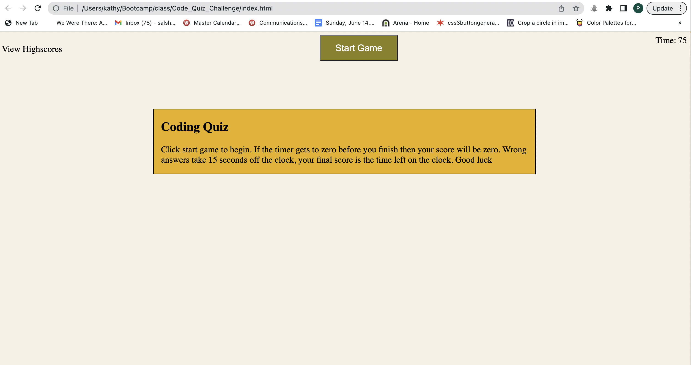
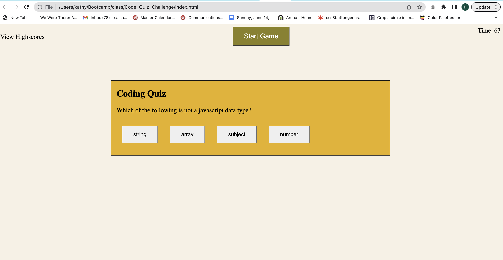
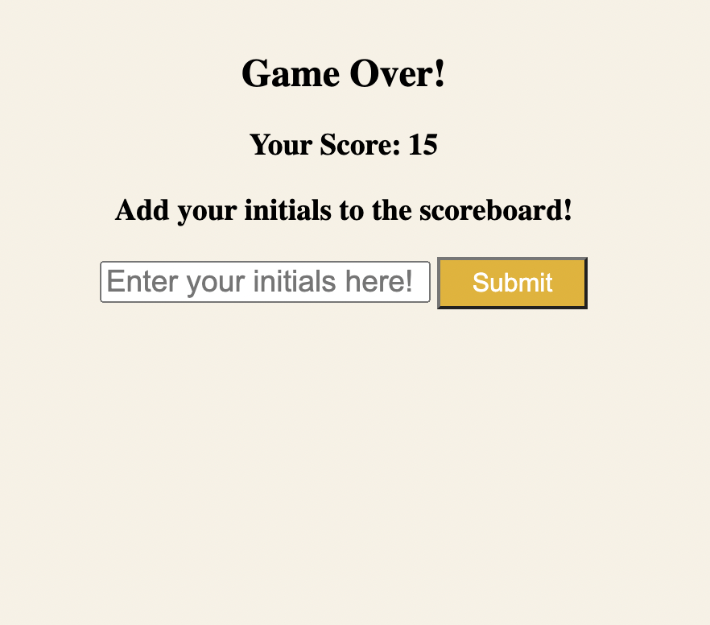
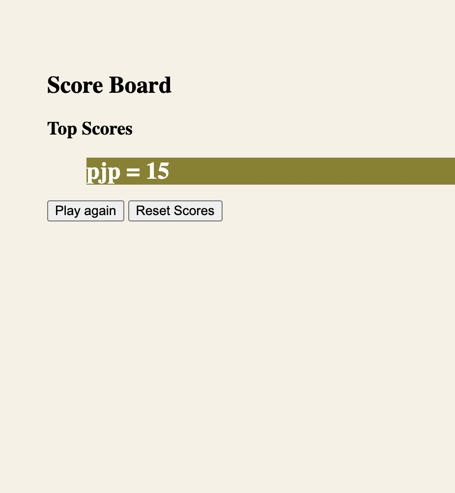

# Quiz Game

This is a 5 question timed quiz to test ones knowledge of coding.

## description

The quiz begins with a set of rules de=isplayed on the page: you have 75 seconds to answer five questions. For every wrong answer the clock loses fifteen seconds . Your score is the amount of time left on the clock after you answer the last question. If the clock runs to zero then the game ends and your score is zero. This quiz relies mainly on javascript to run and has very little HTML and CSS.  Much of the styling and content is created in and delivered by Javascript.

## Screen Shots

## Credits

I used the tools that I've learned in Rice university Boot Camp as well as research in MDN and W3 schools online.  I also watched a video from the CodeExplained youtube channel that had similar aspects to this project [https://www.youtube.com/watch?v=49pYIMygIcU](https://www.youtube.com/watch?v=49pYIMygIcU).

[MDN](https://developer.mozilla.org/en-US/)

[W3 school](https://www.w3schools.com/)

## License

MIT
Copyright 2023 Phillip Pfister

Permission is hereby granted, free of charge, to any person obtaining a copy of this software and associated documentation files (the “Software”), to deal in the Software without restriction, including without limitation the rights to use, copy, modify, merge, publish, distribute, sublicense, and/or sell copies of the Software, and to permit persons to whom the Software is furnished to do so, subject to the following conditions:

The above copyright notice and this permission notice shall be included in all copies or substantial portions of the Software.

THE SOFTWARE IS PROVIDED “AS IS”, WITHOUT WARRANTY OF ANY KIND, EXPRESS OR IMPLIED, INCLUDING BUT NOT LIMITED TO THE WARRANTIES OF MERCHANTABILITY, FITNESS FOR A PARTICULAR PURPOSE AND NONINFRINGEMENT. IN NO EVENT SHALL THE AUTHORS OR COPYRIGHT HOLDERS BE LIABLE FOR ANY CLAIM, DAMAGES OR OTHER LIABILITY, WHETHER IN AN ACTION OF CONTRACT, TORT OR OTHERWISE, ARISING FROM, OUT OF OR IN CONNECTION WITH THE SOFTWARE OR THE USE OR OTHER DEALINGS IN THE SOFTWARE.